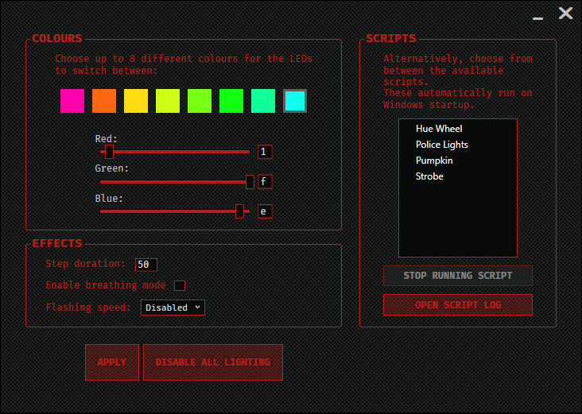

 MSIRGB is an alternative to MSI Mystic Light for controlling motherboard LEDs*. Unlike the latter, there is no limitation to 7 fixed colours.
 
 Aside from providing a GUI for quickly experimenting with different basic effects, it also provides a scripting interface to create more advanced effects like [this one](#example-effects) and to auto-run these effects on Windows startup.
 
 Many thanks to [nagisa/msi-rgb](https://github.com/nagisa/msi-rgb) which helped me start this project.
 
 **NOTE: MSIRGB is in bug-fix only-mode. No new features will be added, so don't bother asking. Lua scripts already allow you to do whatever you might feel like doing, within the boundaries set by hardware limitations.**
 
 \* It has been reported to affect all motherboard LEDs as well, but I do not guarantee it.
 
 # How to use
  1. Make sure you're running a 64-bit release of Windows 10.
  2. Make sure you don't have any anti-cheat enabled. Riot Vanguard and FACEIT Anti-Cheat are known to block MSIRGB from running.
  1. Follow the instructions [here](#how-to-install) to download & install MSIRGB. **Check if your motherboard is supported. [I provide no warranty should your motherboard malfunction.](#license)**
  
# Example effects
Hue Wheel

 
 
# How it works

When you run MSIRGB, you will see this GUI. Here you can experiment with simple effects by changing hardware-implemented settings in your motherboard.

- **Colours**: You can choose to change between 8 different colours. The order by which the motherboard switches between them is from left to right, and then right to left, as displayed. You can choose from 4096 different colours (4 bits per channel, hardware limited).

- **Step duration**: This is the interval of time between each change of colour. Possible values are 0 to 511, inclusive.

- **Breathing mode**: This is one of the two flashing modes supported by all the motherboards that MSIRGB targets. Breathing mode flashes from on to off and back again by gradually changing brightness. The speed of this effect cannot be changed.

- **Flashing mode**: This other flashing mode flashes from on to off and back again instantly, and the speed of the effect can be changed to different preset values.

- **Scripts**: Scripts allow you to leverage these hardware-implemented functions to create more advanced effects. While the functionality provided by the motherboard seems minimal, you can create some interesting effects with them. Currently MSIRGB has a few example effects you can download and try: the [hue wheel effect](#example-effects), the strobe effect, the police lights effect, the heartbeat effect and the pumpkin effect. New effects are always welcome. Feel free to open a pull request if you'd like to contribute (I apologise in advance for being so nitpicky about code quality).

# Scripting interface (for creating effects)
Learn more about how to create scripts and find the Lua API reference in the [wiki](../../wiki/Scripts).

# How to install
 1. Check if your motherboard is supported [here](#motherboard-support). If it is, you may proceed. If it isn't, it's possible the program won't work with your motherboard. Other MSI motherboards may be supported despite not being listed. Non-MSI motherboards are not supported and MSIRGB will not run on those.
 2. Install [VC Redist 2019 x64](https://aka.ms/vs/16/release/vc_redist.x64.exe).
 3. Download the [latest release](https://github.com/ixjf/MSIRGB/releases/download/v2.3.0/MSIRGB-v2.3.0.zip).
 4. Download the [latest example effects](https://github.com/ixjf/MSIRGB/releases/download/scripts-v2.2.0/MSIRGB-Scripts.7z).
 5. Unpack the archive from 3. into any folder, then create a "Scripts" folder in that same directory and unpack the archive from 4. there, such that your directory structure is like this:
    - Scripts/
        - Hue Wheel.lua
        - ...
    - ...
    - MSIRGB.exe
 6. Run MSIRGB.exe. It'll ask you for administrator privileges. This is required to access the hardware.

# Motherboard support
 *This is not an exhaustive list of all motherboards supported by MSIRGB. There may be others not listed here that also work. It may also be the case that some of these aren't actually supported. Running MSIRGB on an unsupported motherboard and ignoring the warning message on startup may lead to damage to your data or the motherboard. Do it at your own risk.*

 - B450I GAMING PLUS AC (works)
 - X470 GAMING PLUS (works)
 - X470 GAMING PRO (works)
 - Z270 GAMING M7 (works)
 - B450 TOMAHAWK (works)
 - B450 TOMAHAWK MAX (works)
 - H370 GAMING PLUS (works)
 - B450M MORTAR (works)
 - B450M MORTAR TITANIUM (works)
 - B450M BAZOOKA PLUS (works)
 - B250M MORTAR (works)
 - B350M PRO-VDH (works)
 - B450M BAZOOKA V2 (works)
 - B450 GAMING PLUS (works)
 - B250M BAZOOKA (works)
 - Z270 GAMING M6 AC (works)
 - Z270 GAMING M5 (works)
 - B360M GAMING PLUS (works)
 - X370 GAMING PLUS (works)
 - B450-A PRO MAX (works)
 - B450M PRO-VDH MAX (works)
 - MPG Z390 GAMING PLUS (works)
 - B450 GAMING PLUS MAX (works)
 - B450M MORTAR MAX (works)
 - B450M PRO-VDH PLUS (works)
 - B350 TOMAHAWK (works, but will give warning message on start)
 - B350 GAMING PLUS (works, but will give warning message on start)
 - B350 PC MATE (works, but will give warning message on start)
 - A320M BAZOOKA (works, but will give warning message on start)
 - B350M MORTAR ARTIC (works, but will give warning message on start)
 - B350 KRAIT GAMING (works, but will give warning message on start)
 - X370 KRAIT GAMING (works, but will give warning message on start)
 - B350M MORTAR (works, but will give warning message on start)
 - Z270 GAMING M3 (works, but will give warning message on start)
 - H270 GAMING PRO CARBON (works, but will give warning message on start)
 - B350M BAZOOKA (works, but will give warning message on start)
 - B250M GAMING PRO (works, but will give warning message on start)
 - B350 GAMING PRO CARBON (works, but will give warning message on start)
 - B350I PRO AC (untested, should work)
 - A320M GAMING PRO (untested, should work)
 - B350M GAMING PRO (untested, should work)
 - A320M GRENADE (untested, should work)
 - B450M PRO-VDH (untested, should work)
 - B450M BAZOOKA (untested, should work)
 - Z370 OC GAMING (untested, should work)
 - Z370 GAMING PLUS (untested, should work)
 - Z370M MORTAR (untested, should work)
 - Z370 PC PRO (untested, should work)
 - Z370-A PRO (untested, should work)
 - Z370 GAMING PRO CARBON AC (untested, should work)
 - Z370 GAMING PRO AC (untested, should work)
 - Z270 SLI PLUS (untested, should work)
 - Z270 KRAIT GAMING (untested, should work)
 - Z270 GAMING PRO (untested, should work)
 - Z270 TOMAHAWK (untested, should work)
 - H270 TOMAHAWK ARTIC (untested, should work)
 - Z299M-A PRO (untested, should work)
 - X299 RAIDER (untested, should work)
 - X399 GAMING PRO CARBON AC (untested, should work)
 - X399 SLI PLUS (untested, should work)
 - X299M GAMING PRO CARBON AC (untested, should work)
 - Z270 XPOWER GAMING TITANIUM (untested, should work)
 - H270 GAMING M3 (untested, should work)
 - B250M MORTAR ARTIC (untested, should work)
 - B250M PRO-VDH (untested, should work)
 - B250 PC MATE (untested, should work)
 - H270 PC MATE (untested, should work)
 - 7A78 (revision >1.x, untested, should work)
 - B250M BAZOOKA OPT BOOST (untested, should work)
 - H310M PRO-VL (untested, should work)
 - B360M MORTAR TITANIUM (untested, should work)
 - B360M PRO-VDH (untested, should work)
 - B360M BAZOOKA (untested, should work)
 - H310M PRO-VHL (untested, should work)
 - 7B30 (untested, should work)
 - B360I GAMING PRO AC (untested, should work)
 - MPG Z390I GAMING EDGE AC (untested, should work)
 - MAG Z390M MORTAR (untested, should work)
 - Z390-A PRO (untested, should work)
 - Z390 PLUS? / 7C22 (untested, should work)
 - 7C24 (untested, should work)
 - 7C01 (untested, should work)
 - B365M PRO-VDH (untested, should work)
 - B450A-PRO (untested, should work)
 - B450M GAMING PLUS (untested, should work)
 - B350M PRO-VDH (untested, should work)
 - X470 GAMING PLUS MAX (untested, should work)
 
 # How to build
 1. Install Visual Studio 2019 with C++ desktop development tools, C# and WPF support. The project is currently set to use the Windows 10 SDK build 17663, but it should work with any other.
 2. Open the solution (MSIRGB.sln)
 3. Select debug/release target & build.
 
# License
 The code is licensed under the ISC license - the same one that [nagisa/msi-rgb](https://github.com/nagisa/msi-rgb) uses. You're free to use, modify, redistribute and even use it in any commercial projects so long as you keep the copyright notice. **Be aware that this means I provide no warranty whatsoever should your motherboard malfunction**.
